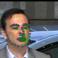
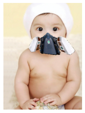

# facial keypoints detection

####  Data

<p style='text-align: justify;'> 
Facial keypoints (also called facial landmarks) are the small magenta dots shown on each of the faces in the image above. In each training and test image, there is a single face and 68 keypoints, with coordinates (x, y), for that face. These keypoints mark important areas of the face: the eyes, corners of the mouth, the nose, etc. These keypoints are relevant for a variety of tasks, such as face filters, emotion recognition, pose recognition, and so on. Here they are, numbered, and you can see that specific ranges of points match different portions of the face.
</p>

<p align="center">

</p>

<p style='text-align: justify;'> 
The data is from: https://github.com/rupaai/facial_keypoint_detection
</p>

Here are some sample images in the dataset:

<p align="center">

</p>

#### Model
In this project, EfficientNet-b0 with pretrained weights from ImageNet was used. Model architecture is shown below.

<p align="center">

</p>

<p style='text-align: justify;'>
According google AI news, EfficientNet models achieve both higher accuracy and better efficiency over existing CNNs with less number of parameters. More details seen: https://ai.googleblog.com/2019/05/efficientnet-improving-accuracy-and.html
</p>

<p align="center">

</p>

####  Model Training:
We used 3462 images for training and 770 images for test and trained the model for 100 epochs with hyperparameters as below:
```
criterion = nn.SmoothL1Loss()
optimizer = optim.Adam(params = net.parameters(), lr = 0.001)
scheduler=optim.lr_scheduler.ReduceLROnPlateau(optimizer, mode='min', factor=0.1, patience=10, threshold=0.0001, verbose=True)
```
<p align="center">

</p>

And here are some of the keypoints detection results for the test images:
<p align="center">

</p>

#### Application
After getting the model, we used the model to predict facial keypoints and add a mask on the face via wrapping.

**1. facial keypoint detection**

Run the face_landmark function in the prediction.ipynb with input image could return this image with keypoints showing.

- imagepath(string): is the path for the input image. Note: the input face should be front face.
- crop(boolean): True is for detect and crop face, False represent using the original image. Use True if the input image is not a head only photo. Default is False

```
face_landmark(imagepath,crop)
```
**2. adding mask to face**

We prepared 7 different types of masks.User can select one of the mask we provided and one image, then we could output the face wearing the mask.

mask library:

<p align="center">
<table><tr><td>Mask 1</td><td>Mask 2</td><td>Mask 3</td><td>Mask 4</td><td>Mask 5</td><td>Mask 6</td><td>Mask 7</td>
 </tr><tr>
    <td></td>
    <td></td>
    <td></td>
	<td></td>
	 <td></td>
	 <td></td>
	 <td></td>
  </tr></table></p>

Run the face_mask function in the prediction.ipynb with input image and mask id could return this image wearing the mask.

- imagepath(string): is the path for the input image. Note: the input face should be front face.
- mask_id(int): is for choosing a certain mask
- crop(boolean): True is for detect and crop face, False represent using the original image. Use True if the input image is not a head only photo. Default is False

```
face_mask(imagepath,mask_id,crop)
```

**How we did it?**

To map four corners of a mask to one’s nose, lower jaw and two sides of cheek ,we apply homography matrix using SVD. As long as keypoints are well estimated, the wrapping should be beautiful.

1.For normal mask, we match the four point shows in the mask image below with the four point shows in the face below.
<p align="center">
</p>

2.We also do this on some cool masks, for example, the one weared by Bane From "Batman:The Dark Knight Rises"

<p align="center">
</p>

For those cool masks without the lowest point, we match the lower jaw with the center bottom point of the masks.

<p align="center">
</p>

**Many samples here**
<p align="center">
</p>
<p align="center">
</p>

